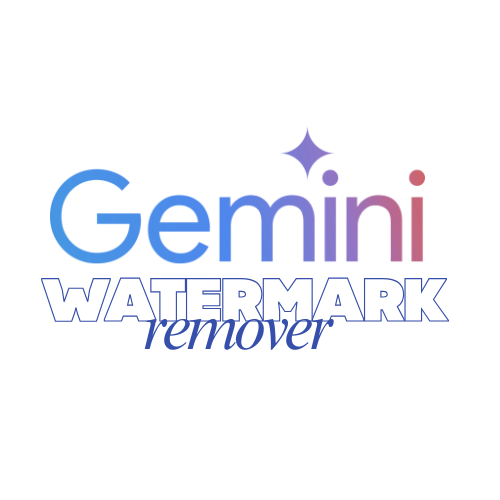

<p align="center">
  
</p>

# Gemini Watermark Remover

An advanced, privacy-first browser extension that automatically removes AI-generated watermarks from images created with Google Gemini.

## Overview

Gemini Watermark Remover is built for users who regularly work with images generated by Google Gemini. It removes the embedded watermark automatically before download, so the images you save are clean and ready for use without extra tools or quality loss.

The extension runs silently in the background and only activates on the Gemini website. There are no buttons, no settings, and no manual steps during usage.

Tested and verified on both Google Chrome and Microsoft Edge.

## How It Works (Reverse Alpha Blending)

Gemini applies its watermark using alpha blending. This extension reverses that process mathematically to restore the original pixel data.

Watermarked pixel model:

$$
C_{watermarked} = \alpha \cdot C_{logo} + (1 - \alpha) \cdot C_{original}
$$

Recovered pixel calculation:

$$
C_{original} = \frac{C_{watermarked} - \alpha \cdot C_{logo}}{1 - \alpha}
$$

Where:
- $C_{original}$ is the restored pixel value
- $C_{watermarked}$ is the visible pixel value
- $\alpha$ is the transparency mask derived from watermark samples
- $C_{logo}$ is the fixed watermark color value ($255$)

The extension uses precomputed watermark templates for both standard Gemini watermark sizes.

## Features

- Automatic watermark removal with no user interaction
- Works with the normal Gemini download button
- No quality loss or visible artifacts
- All processing happens locally in the browser
- No tracking, analytics, or data collection
- Lightweight and optimized for performance
- Compatible with Manifest V3

## Before and After Examples

| Before (With Watermark) | After (Watermark Removed) |
|-------------------------|---------------------------|
|  |  |


## Installation

### Microsoft Edge (Recommended)

Install directly from the Microsoft Edge Add-ons Store:

[Microsoft Store link here](https://microsoftedge.microsoft.com/addons/detail/nlfhgjjionkpldaikdlhmjhhpkjnpmle)

### Google Chrome (CRX Install)

For Chrome users, a packaged CRX file is included in the releases.

1. Download the **.crx** file from the releases section.
2. Open **chrome://extensions**
3. Enable Developer Mode.
4. Drag and drop the **.crx** file into the extensions page.
5. Confirm installation.

> Note: If Chrome blocks CRX installation, use the manual installation method below.

### Manual Installation (Chrome and Edge)

1. Download the source code and unzip it.
2. Open your browser and go to:
   - Chrome: *chrome://extensions*
   - Edge: *edge://extensions*
3. Enable Developer Mode.
4. Click **Load unpacked**.
5. Select the extracted project folder.

The extension will activate automatically on the Gemini website.

## Usage

1. Visit the Gemini AI website.
2. Generate or view images as usual.
3. Click the normal download button.
4. The downloaded image will have no watermark.

No additional steps are required.

## Development

To modify or rebuild the extension:

1. Edit _src/content.template.js_
2. Run the build script:
      ```
      node build.js
      ```

This regenerates the final content script using the updated watermark templates and logic.

## Privacy

- No personal data collected
- No images uploaded or transmitted
- No external network requests
- Everything runs locally on your device
